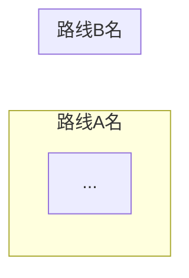

# Synthesis Page Template

File: `Wiki/Synthesis/{{topic-slug}}.md`

```markdown
---
title: "{{标题}}"
type: synthesis
scope:
  - "[[paper-slug-1]]"
  - "[[paper-slug-2]]"
question: "{{驱动问题}}"
created: {{YYYY-MM-DD}}
updated: {{YYYY-MM-DD}}
---

# {{标题}}

> [!abstract] Research Question
> {{驱动问题的完整描述}}
>
> **覆盖范围**：{{N}} 篇方法 + {{M}} 篇 benchmark/评测，时间跨度 {{year range}}
> - **方法侧**：...
> - **评测侧**：...
> - **交叉洞察**：...

---

## Landscape — 横向对比

### Method / Benchmark Papers（按论文类型选择合适的表头）

Method 表推荐列：

| Paper | Venue | 核心机制 | 个性化信号来源 | 适应速度 | 训练需求 | 延迟开销 | 核心局限 |

Benchmark 表推荐列：

| Benchmark | Venue | 域 | 模态 | 规模 | 核心评测维度 | 关键发现 |

> [!tip] 路线分类
> 用 mermaid 图展示方法路线之间的关系和分类。



### 能力覆盖矩阵（仅 benchmark synthesis 需要）

> [!info] 评测维度覆盖分布
> `●` 主要评测 / `○` 部分涉及 / `-` 未覆盖

| Benchmark | 维度1 | 维度2 | ... |

> [!danger] 覆盖盲区
> 标注未被任何 benchmark 覆盖的关键维度。

---

## Cross-Paper Findings — 跨论文共性发现

每个 Finding 用 `[!success]` callout，包含：
- Evidence 密度（N/总数 篇直接涉及）
- 具体证据（带 wiki-link 到源论文）
- 根源分析

> [!success] F1: {{发现标题}}
> **Evidence 密度：N/M 篇直接涉及**
>
> {{具体证据，用 [[paper-slug]] 链接到源论文}}
>
> **根源**：{{一句话总结根本原因}}

### Findings 证据热力图

> [!example] 各发现的论文支撑分布

| | F1 | F2 | F3 | ... |
|---|:---:|:---:|:---:|
| **类型A (N)** | 数量 | ... | ... |
| **类型B (M)** | 数量 | ... | ... |

---

## Contradictions & Tensions — 论文间矛盾

每个矛盾用 `[!warning]` callout，包含正方/反方/调和三段。

> [!warning] T1: {{矛盾标题}}
> - **正方**：...
> - **反方**：...
> - **调和**：...

---

## Open Questions — 尚未解决的问题

每个问题用 `[!question]` callout，包含问题/重要性/可能方向。

> [!question] OQ1: {{问题标题}}
> **问题**：...
>
> **为什么重要**：...
>
> **可能方向**：...

---

## Implications for Our Work — 对自己研究的启示

> [!tip] 核心行动建议

{{具体的行动建议，每条带理由}}

### 评测选择建议

| 研究方向 | 推荐 Benchmark | 理由 |
```

---

## 写作原则

1. **以 Research Question 开头**——不是漫无目的的总结
2. **Findings 按主题组织**，不按论文——这是 synthesis 区别于 survey 的核心
3. **每条 Finding 必须带 Evidence**——用 `[[wiki-link]]` 链回源论文，确保可溯源
4. **Contradictions 独立成节**——论文间的矛盾是最有价值的发现
5. **最后一节强制 connect back**——对自己研究的具体启示，不是泛泛的"future work"
6. **表格列按 scope 论文类型适配**——method 比机制/开销，benchmark 比规模/维度
7. **mermaid 图用于展示路线关系**——不是装饰，是信息密度最高的表达方式
