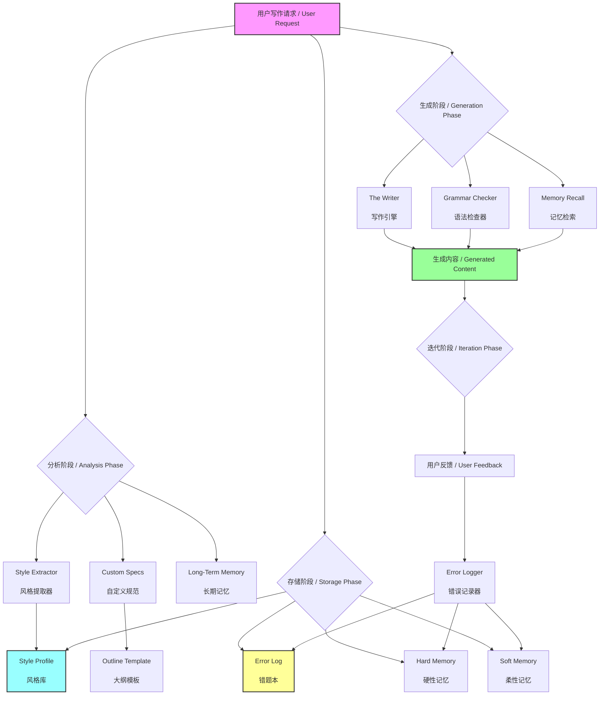
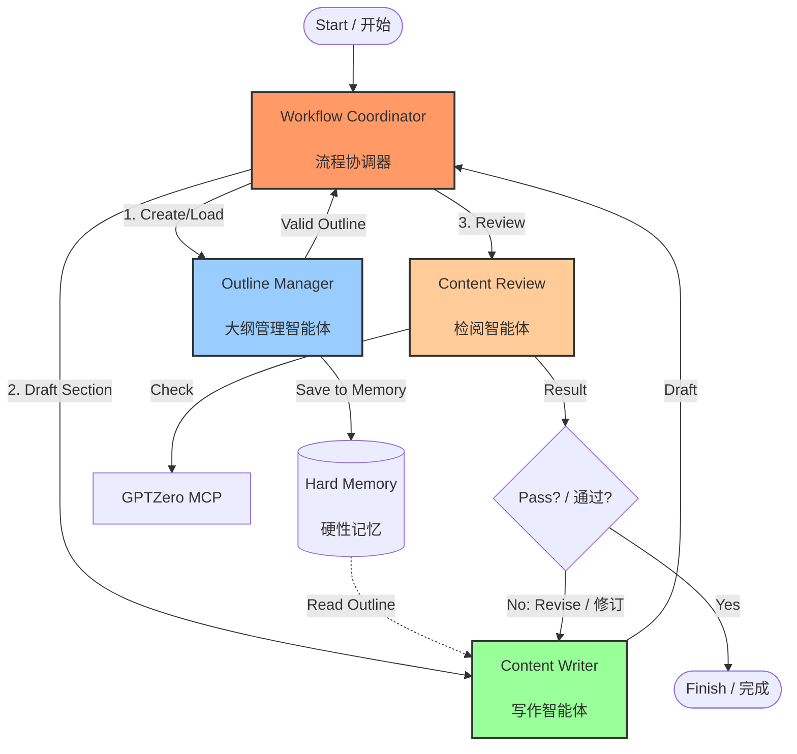

# AI Vibe Writing Skill for Agent / AI 写作助手

[](https://opensource.org/licenses/MIT)

> An AI Skill that provides "Style Transfer" and "Error Memory" capabilities for personalized writing.
> 
> 一个具备“风格迁移”和“错误记忆”功能的 AI 写作助手，打造你专属的“影子写手”。

## 🌟 What's New / 更新日志

**v1.4 - Multi-Agent Writing Skill / 多智能体协作写作**
Added outline-manager, content-writer, content-review agents with a coordinator loop.
新增大纲管理、写作、检阅智能体与流程协调器，完成写作闭环。

**v1.3 - Writing Knowledge Bases / 写作知识库**
Added curated writing knowledge bases for grant proposals, papers, and theses.
新增基金、论文与学位论文写作知识库，支持按写作类型检索与应用。

**v1.2 - Long-Term Memory / 长期记忆**
Added domain-based hard/soft memory to preserve precise terms and user preferences.
新增按领域划分的硬性/柔性记忆，用于精准术语与偏好存储。

**v1.1 - Grammar & Spell Checker / 语法与拼写检查器**
Added a dedicated module to detect and correct grammatical errors and typos in both English and Chinese.
新增了专用的语法与拼写检查模块，支持中英文双语纠错。

## 🧠 Why I Exist / 设计初衷
本工程（AI-Vibe-Writing-Skills）的初衷，是跳出 “AI 替代创作” 的误区，聚焦于AI 的辅助价值
将写作从重复、机械的 “dirty work”（如素材整理、格式规范、基础校对、灵感初步筛选等）中解放出来，把精力聚焦在创意构思、内容深度打磨、风格个性化等核心环节，最终实现更高效率、更高质量的内容生产。

## 🧩 Core Capabilities / 核心功能

### 🎭 STYLE TRANSFER / 风格迁移
**Mimic**: Analyzes your past writings to extract "Style DNA".  
**Consistency**: Maintains your unique tone, sentence structure, and vocabulary.  
**原理**: 分析过往文章提取“风格指纹”，保持语调、句式和用词的一致性。

### 🧠 ERROR MEMORY / 错误记忆
**Learning**: Remembers your corrections and "Don'ts".  
**Avoidance**: Automatically checks against the "Error Log" before writing.  
**原理**: 记住你的纠正和禁忌，在生成前自动查阅“错题本”以避免重犯。

### 📝 GRAMMAR CHECK / 语法检查
**Quality**: Built-in bilingual grammar and spell checker.  
**Review**: Identifies typos and awkward phrasing without changing your style.  
**原理**: 内置中英文双语语法检查，识别错别字和语病，同时保留原有风格。

### 🧠 LONG-TERM MEMORY / 长期记忆
**Hard Memory**: Stores exact terms, units, and key values by domain.  
**Soft Memory**: Stores preferences, phrasing, and tone by domain.  
**原理**: 硬性记忆用于术语、单位、关键数值的精确存储；柔性记忆用于偏好与表达习惯的持续适配。

### 📚 WRITING KNOWLEDGE BASES / 写作知识库
**Grant**: Reviewer-aligned structure, persuasion, and feasibility cues.  
**Paper**: Academic rigor, novelty framing, and LaTeX cleanliness.  
**Thesis**: Long-form clarity, topic sentences, and narrative flow.  
**原理**: 针对不同写作类型沉淀可复用规范，按领域检索并持续迭代。

### 🤝 MULTI-AGENT COLLABORATION / 多智能体协作写作
**Outline Manager**: Enforces outline constraints and validates outputs.  
**Writer**: Drafts and revises under outline and memory constraints.  
**Reviewer**: Detects AI tone and integrates multi-platform checks.  
**原理**: 通过大纲约束→内容创作→AI 味检测→多平台核验实现闭环。

### ⚙️ CUSTOMIZATION / 自定义规范
**Context**: Adapts to specific audiences (e.g., Technical, General) and topics.  
**Outline**: Manages structure for long-form content.  
**原理**: 自动适配目标受众和主题，支持长文大纲管理。


### Quick Trigger Examples / 快速触发示例
> "Use outline-manager-agent to generate a 3-level outline for topic X."
> 
> “调用大纲管理智能体，为主题 X 生成三级大纲。”

> "Use content-writer-agent to draft section 2 based on outline-001."
> 
> “调用写作智能体，基于 outline-001 写第 2 节。”

> "Use content-review-agent to review the latest draft and report AI tone."
> 
> “调用检阅智能体，检查最新草稿并输出 AI 味报告。”

> "Use workflow-coordinator to run the full multi-agent loop."
> 
> “调用流程协调器，执行完整多智能体闭环。”

##  How to Start / 如何开始使用

You can activate this system immediately by following these steps:
你可以立即尝试以下步骤来“激活”这个系统：

### Step 0: Installation (Mandatory) / 安装（必读）
**You MUST clone the full repository to use this system.** 
The system relies on the local `.ai_context` folder for memory, style profiles, and agent configurations. Without cloning, the agents cannot access your style or project settings.
**你必须克隆完整仓库才能使用本系统。**
系统依赖本地 `.ai_context` 文件夹来读取记忆、风格配置和智能体设置。如果不克隆，智能体将无法访问你的风格或项目设置。

```bash
git clone https://github.com/donghuixin/AI-Vibe-Writing-Skills.git
```
Open the cloned folder in your IDE (Trae, VS Code, Cursor) to activate the context.
克隆后在 IDE（Trae, VS Code, Cursor）中打开该文件夹以激活上下文。

### Step 1: Agent Selection / 智能体选择指南
Choose the right agent for your task. You don't always need all of them.
根据你的任务选择合适的智能体组合，不需要每次都全量开启。

| Goal / 目标 | Recommended Agents / 推荐智能体 | Why / 原因 |
| :--- | :--- | :--- |
| **Simple Writing** / 简单写作 | **Content Writer** | Direct drafting with style mimicry. <br> 直接生成，保留风格。 |
| **Long-form Content** / 长文创作 | **Outline Manager** + **Content Writer** | Ensures logical structure and flow. <br> 保证长文结构逻辑严密。 |
| **Quality Assurance** / 质量把控 | **Content Writer** + **Content Review** | Checks for AI tone and plagiarism. <br> 检测 AI 味和查重。 |
| **Full Automation** / 全自动闭环 | **Workflow Coordinator** | Orchestrates the full loop (Outline → Write → Review). <br> 自动调度全流程。 |

### Step 2: Style Extraction / 提取风格
**Required for first-time use.**
Provide 3-5 of your past high-quality writings to the AI.
**首次使用必须执行。**
把你的 3-5 篇过往高质量文章发给 AI，并说：

> "Please use the **Style Extractor** to analyze these texts and update `style_profile.md`."
>
> “请使用 **Style Extractor** 分析这些文章，并更新 `style_profile.md`。”

### Step 3: Customization / 配置规范
**Optional but recommended.**
Open `.ai_context/custom_specs.md` and fill in your common writing context.
**可选但推荐。**
你可以打开 `.ai_context/custom_specs.md`，填入你常用的写作背景，这样我每次写作都会自动适配这些背景。

Example / 例如：
- **Audience / 受众**: Technical Beginners / 技术小白
- **Domain / 领域**: Artificial Intelligence / 人工智能

### Step 4: The Writer / 日常写作
**Agent: Content Writer**
Just give a task. No need to repeat complex prompts.
直接发布任务即可，无需每次重复 Prompt。

> "Based on my style, write an introduction to RAG technology."
>
> “基于我的风格写一篇关于 RAG 技术的介绍。”

*I will automatically read `style_profile.md` to mimic your tone and check `error_log.md` to avoid taboos.*
*我会自动读取 `style_profile.md` 模仿你的语气，并检查 `error_log.md` 避开禁忌。*

### Step 5: Error Logger / 纠错迭代
If I make a mistake (e.g., use a word you dislike), correct me immediately.
如果我犯了错（比如用了你不喜欢的词），直接告诉我：

> "Don't use the word 'delve'. Add this to my error log."
>
> “不要用‘delve’这个词，把它加入错题本。”

*I will automatically update `error_log.md` to ensure I don't make the same mistake again.*
*我会自动更新 `error_log.md`，保证下次不再犯。*

### Step 6: Long-Term Memory / 长期记忆
Provide durable domain facts or preferences to store.
提供稳定的领域事实或偏好以便长期存储：

> "In medical writing, always use mmol/L for glucose. Save this as hard memory."
>
> “在医学领域，葡萄糖单位固定使用 mmol/L，作为硬性记忆存储。”

### Step 7: Writing Knowledge Bases / 写作知识库
Select a writing domain and apply the corresponding knowledge base.
选择写作类型并应用对应知识库：

> "Use the paper knowledge base and draft the Related Work with reviewer-style rigor."
>
> “调用论文知识库，以审稿人视角写 Related Work。”

### Step 7.5: Reference Learning / 参考文献学习
Provide references to build a local evidence library and reusable knowledge.
提供参考文献以构建本地证据库与可复用知识：

> "Learn these references and store facts, data, terms, and style."
>
> “学习这些参考文献并本地存储事实、数据、术语与风格。”

Configure evidence requirements in `.ai_context/custom_specs.md` and follow `.ai_context/reference_learning.md`.
在 `.ai_context/custom_specs.md` 中设置证据要求，并遵循 `.ai_context/reference_learning.md`。

### Step 7.6: Context Budget / 上下文预算
Set a context budget to keep writing performance stable.
设置上下文预算以保证写作性能稳定：

1. **Max Context Tokens**: 上下文上限
2. **Target Utilization**: 建议使用率
3. **Min Useful Tokens**: 最低有效内容
4. **Compression Strategy**: 压缩策略

Configure in `.ai_context/custom_specs.md`.
在 `.ai_context/custom_specs.md` 中配置。

### Step 8: Multi-Agent Collaboration / 多智能体协作
**Agents: Workflow Coordinator / Outline Manager / Content Writer / Content Review**
Trigger the multi-agent loop and let the system orchestrate writing.
启动多智能体闭环并交由系统协调：

> "Use outline-manager-agent + content-writer-agent + content-review-agent to draft section 2."
>
> "调用大纲管理、写作、检阅三智能体完成第 2 章。"

### Step 9: API Key Configuration / API Key 配置
**Agent: Content Review**
**Ready for AI & Plagiarism Detection.**
The system is pre-configured to support **GPTZero**, **Copyleaks**, and other detection APIs. You just need to add your API key.
**已预置 AI 与查重检测能力。**
系统已预配置支持 **GPTZero**、**Copyleaks** 等检测 API。你只需填入 API Key 即可启用。

1. **Open configuration file**: `.ai_context/custom_specs.md`
2. **Find API Keys section**: Look for "Detector API Keys"
3. **Configure keys**:
   - **GPTZero**: Set your GPTZero API Key (e.g., `env:GPTZERO_API_KEY`)
   - **Other services**: Set keys for Originality, Copyscape, Turnitin, etc.
4. **Environment variables**: Set the actual API keys in your environment

> "Set GPTZero API key in custom_specs.md and environment"
>
> "在 custom_specs.md 中设置 GPTZero API Key 并配置环境变量"

*Note: The system will ask for confirmation before using paid services like GPTZero.*
*注意：系统在使用 GPTZero 等付费服务前会请求用户确认。*

> **Tip**: Looking for free alternatives? Check out [FREE_AI_DETECTION_APIS.md](./FREE_AI_DETECTION_APIS.md) for a curated list of free AI detection APIs (Copyleaks, Sapling, etc.).
>
> **提示**：寻找免费替代方案？查看 [FREE_AI_DETECTION_APIS.md](./FREE_AI_DETECTION_APIS.md) 获取精选的免费 AI 检测 API 列表（如 Copyleaks, Sapling 等）。

---

## 📂 File Structure / 文件结构

- **`FREE_AI_DETECTION_APIS.md`**: Guide to free AI detection APIs.
- **`.ai_context/`**: The brain of the system.
  - `style_profile.md`: Your style fingerprint.
  - `error_log.md`: Your negative constraints.
  - `custom_specs.md`: User-defined writing context.
  - `outline_template.md`: Template for structuring content.
  - `reference_learning.md`: Reference learning pipeline.
  - `memory/hard_memory.json`: Domain hard memory (terms, units, key values).
  - `memory/soft_memory.json`: Domain soft memory (preferences, phrasing, tone).
  - `memory/reference_library.json`: Local reference library.
  - `prompts/`: Core logic prompts.
    - `1_style_extractor.md`
    - `2_writer.md`
    - `3_error_logger.md`
    - `4_grammar_checker.md`
    - `5_long_term_memory.md`
    - `6_outline_manager_agent.md`
    - `7_content_writer_agent.md`
    - `8_content_review_agent.md`
    - `9_workflow_coordinator.md`
- **`.traerules`**: System instructions ensuring the workflow is followed.

## 🗺️ Functional Structure / 功能结构



**Core Logic / 核心逻辑**: 
**分析（提取风格） -> 存储（建立风格库与错题本） -> 生成（RAG 检索增强） -> 迭代（更新错题本）**

**Workflow Explanation / 流程说明**:
1. **Analysis**: The system analyzes user-provided samples and domain context to extract style traits and memory candidates.
2. **Storage**: Hard memory and soft memory are stored by domain alongside the style profile and error log.
3. **Generation**: The Writer retrieves relevant hard/soft memory to ensure accuracy and tone alignment, while the Grammar Checker ensures quality.
4. **Iteration**: User feedback updates both the error log and long-term memory to improve future outputs.
## 🧩 Agent Role Configuration Tutorial / 智能体角色配置教程
This tutorial shows how to configure each agent role using existing prompt and spec files.  
以下教程演示如何通过现有的 prompt 与规范文件配置各智能体角色。

### 1) Outline Manager Agent / 大纲管理智能体
**Purpose / 作用**: Create, store, and validate outlines. / 创建、存储并校验大纲。  
**Where to edit / 编辑位置**:
- `.ai_context/prompts/6_outline_manager_agent.md`
- `.ai_context/outline_template.md`
- `.ai_context/custom_specs.md`

**Configuration Steps / 配置步骤**:
1. **Define Structure**: Open `.ai_context/outline_template.md` and define your preferred outline JSON structure (sections, paragraphs, word ranges).
2. **Set Validation Rules**: In `.ai_context/custom_specs.md`, adjust outline validation thresholds:
   - `Word Deviation Tolerance`: Acceptable deviation from word count targets (e.g., 0.1 for 10%).
   - `Core Point Coverage`: Minimum percentage of core points that must be covered (e.g., 0.9).
3. **Configure Storage**: (Optional) In `6_outline_manager_agent.md`, modify the outline storage key format if needed.

### 2) Content Writer Agent / 写作智能体
**Purpose / 作用**: Draft and revise content based on outline and memory. / 按大纲与记忆写作与修订。  
**Where to edit / 编辑位置**:
- `.ai_context/prompts/7_content_writer_agent.md`
- `.ai_context/custom_specs.md`
- `.ai_context/memory/hard_memory.json`
- `.ai_context/memory/soft_memory.json`

**Configuration Steps / 配置步骤**:
1. **Set Writing Context**: In `.ai_context/custom_specs.md`, define `Target Audience` and `Topic` to guide the writer's tone and depth.
2. **Configure Revision Limits**: In `.ai_context/custom_specs.md`, set `Max Revision Rounds` to control how many times the writer can iterate on a draft.
3. **Populate Memory**:
   - Add domain facts (terms, units) to `.ai_context/memory/hard_memory.json`.
   - Add style preferences (phrasing, tone) to `.ai_context/memory/soft_memory.json`.
4. **Output Format**: (Optional) In `7_content_writer_agent.md`, customize the content output format and metadata fields if specific metadata is required.

### 3) Content Review Agent / 检阅智能体
**Purpose / 作用**: Detect AI tone and aggregate platform checks. / AI 味检测与多平台核验。  
**Where to edit / 编辑位置**:
- `.ai_context/prompts/8_content_review_agent.md`
- `.ai_context/custom_specs.md`

**Configuration Steps / 配置步骤**:
1. **Configure GPTZero MCP (New!)**:
   - The agent now supports GPTZero via MCP for AI detection and plagiarism checking.
   - **Code Reference**: [8_content_review_agent.md](file:///Users/huixin/Documents/ProgramDevelopment/AI_Vibe_Writing_Skill/.ai_context/prompts/8_content_review_agent.md#L17-L56)
2. **Set API Keys & Settings**:
   - Open `.ai_context/custom_specs.md`.
   - Fill in `GPTZero MCP` settings: Service Name, Method, Timeout, and Retry count.
   - Set your `GPTZero API Key`.
   - **Code Reference**: [custom_specs.md](file:///Users/huixin/Documents/ProgramDevelopment/AI_Vibe_Writing_Skill/.ai_context/custom_specs.md#L9-L18)
3. **Usage**: When you trigger "Review" or "Detection", the agent will automatically call GPTZero via MCP and include the results (AI probability, Plagiarism score) in the unified report.
4. **Adjust Thresholds**: In `.ai_context/custom_specs.md`, set `AI Tone Threshold` to determine when a rewrite is triggered.

### 4) Workflow Coordinator / 流程协调器
**Purpose / 作用**: Orchestrate outline → write → review loops. / 协调整体闭环流程。  
**Where to edit / 编辑位置**:
- `.ai_context/prompts/9_workflow_coordinator.md`
- `.ai_context/custom_specs.md`

**Configuration Steps / 配置步骤**:
1. In `9_workflow_coordinator.md`, set the loop order and max revision rounds.
2. In `custom_specs.md`, align coordination rules with your writing cadence.

## 🧭 Multi-Agent Skill IDs / 多智能体 Skill ID
- **outline-manager-agent**
- **content-writer-agent**
- **content-review-agent**
- **workflow-coordinator**

## 🔄 Multi-Agent Workflow / 多智能体协作流程




## 📈 Star History

[](https://star-history.com/#donghuixin/AI-Vibe-Writing-Skills&Date)
If the chart looks stale, update the cache parameter to force refresh.
如果图表显示滞后，可更新 cache 参数以强制刷新。

## 📄 License

This project is licensed under the [MIT License](./LICENSE).
